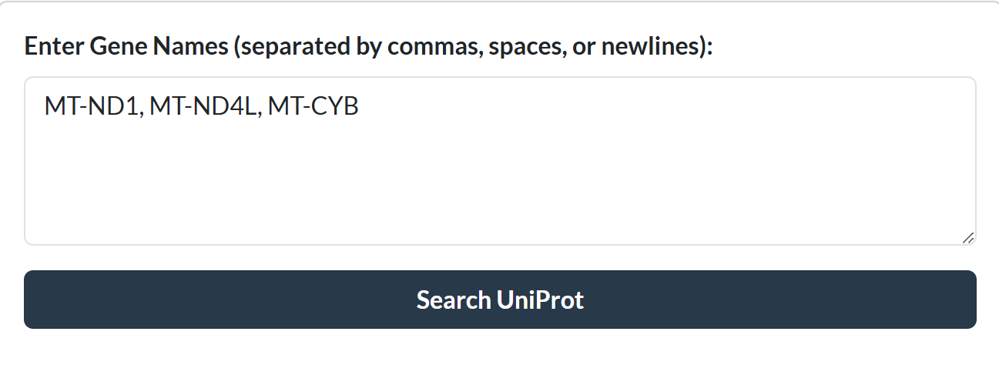
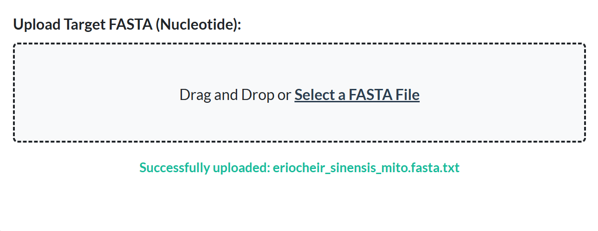
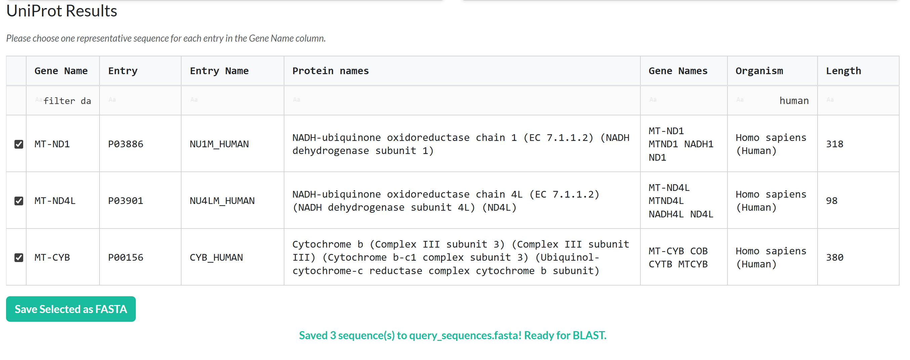
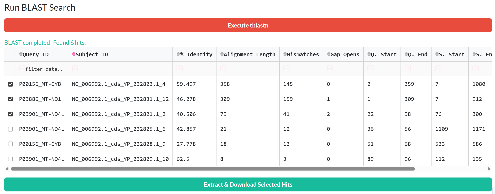
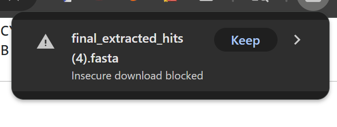

# SeqScraper

A Python-based dashboard designed to simplify the process of converting gene names into UniProtKB protein entries, and then using those entries to systematically scrape a target nucleotide FASTA file for orthologous sequences using NCBI BLAST.

## Scientific Motivation (Purpose)

In biological research, I frequently find the need to locate specific genes within newly sequenced or unannotated genomes (like mitochondrial or chloroplast assemblies). Manually looking up protein sequences, running BLAST via the command line, parsing the tabular output, and extracting the final sequences is tedious and error-prone.

SeqScraper automates this entire pipeline into a single, user-friendly graphical interface. Biologists can input common gene names, pick their preferred reviewed protein sequences, and instantly extract the full corresponding nucleotide sequences from their target genome into a clean, ready-to-use FASTA file for downstream analysis.

## Docker Container Setup Instructions

This dashboard is deployed using a Docker container through docker-compose. A local container is built alongside a publically available Redis container.

### Startup the Container

Run this code in a bash terminal to build the image from the repo Dockerfile.\
`-t`: This will assign your image a local name.

```bash
docker compose up
```

If the command was succesful, you should see a long redis printout capped off with the following:

```bash
seqscraper-app-1  | Dash is running on http://0.0.0.0:8050/
seqscraper-app-1  | 
seqscraper-app-1  | [2026-05-02 05:51:51,731 9fd0b3d6e602] dash.py:run:2521 - INFO: Dash is running on http://0.0.0.0:8050/
seqscraper-app-1  | 
seqscraper-app-1  |  * Serving Flask app 'app'
seqscraper-app-1  |  * Debug mode: on
```

Go to the address listed through a web browser [0.0.0.0:8050](http://0.0.0.0:8050/). If you happen to be on a virtual machine or HPC, you may need to replace 0.0.0.0 with your IP address. You can use `curl ip.me` to find yours.

### Stop the Container

To stop the container, first close out the dashboard. In your terminal hit `ctrl + c` to stop the dashboard. You can then run the following command to teardown the Docker container to keep your environment clean.

```bash
# ctrl + c to force quit the Dash app
docker compose down
```

## Dashboard Usage

Images will show example usage of dashboard. Input file can be downloaded at [NCBI](https://www.ncbi.nlm.nih.gov/nuccore/?term=Eriocheir+sinensis+genome). Use the "send to" drop down with coding sequences and FASTA Nucleotide selected.

## Step 1: Query UniProt & Upload Target Database

Gene Input: In the first box, enter a list of gene names you are looking for (e.g., brca1, cox1, atp6). Click Search UniProt.



FASTA Upload: In the second box, drag and drop your target genome (nucleotide .fasta/.fna file). This file will be copied to your local data/ folder.



## Step 2: Select Representative Sequences

The UniProt API will often return multiple hits for a single gene (from different species or alternative sequences).

Use the text boxes directly under the column headers to filter the table (eg., type "Human" in the Organism column, or "MT-ND1" in the Gene Name column).

Check the box next to the representative protein sequence you want to use as your BLAST query for that gene. You can use more than one representative protein sequence if you aren't sure which sequence is the most related to your species.

Click Save Selected to FASTA.



## Step 3: Run BLAST & Extract

Click the red Execute tblastn button. The app will build a BLAST database from your uploaded FASTA and align your selected UniProt proteins against it.

Review the BLAST results table (paying attention to E-value and Bit Score). Select the hits you believe are true orthologs using the checkboxes (>50 bitscore is recommended).



Click Extract & Download Selected Hits. The tool will automatically use `blastdbcmd` to extract the full sequence for those hits and download a final_extracted_hits.fasta file to your browser. If your browser flags the download as dangerous, make sure to click keep.


